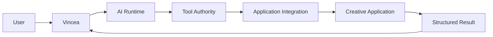
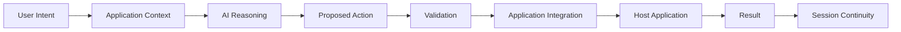

# Vincea

Vincea is an AI interaction layer for professional creative applications. It is designed to help AI understand application context, work with user intent, and perform approved actions inside professional workflows.

> This repository is the public technical/developer surface of Vincea. It is not a full source distribution of the product.

## Why Vincea exists

Creative applications are not ordinary chat surfaces. They contain documents, scenes, timelines, selections, object graphs, project state, application-specific rules, and operations with real side effects.

Vincea is designed around that reality.

Instead of treating the host application as a passive destination, Vincea treats application context, bounded capabilities, validation, execution results, and session continuity as first-class parts of AI-assisted work.

## System view

The public architecture documentation intentionally stays at a system-concept level. It explains responsibilities, safety boundaries, and developer design principles without exposing proprietary production implementation details.

Vincea uses proprietary runtime, distribution, activation, and production infrastructure that are outside the scope of this repository.

## Request lifecycle

Read the full conceptual lifecycle in [docs/request-lifecycle.md](docs/request-lifecycle.md).

## Core design principles

Vincea's public developer model emphasizes:

- application-aware AI interaction rather than chat-only behavior;
- explicit capability boundaries;
- validation before application execution;
- clear side-effect reporting;
- provider-independent integration design;
- session continuity without hiding application reality;
- safe, understandable failure;
- strict separation between public integration material and proprietary production implementation.

See [docs/design-principles.md](docs/design-principles.md).

## Technical documentation

### Architecture and runtime

- [Architecture overview](docs/architecture-overview.md)
- [Request lifecycle](docs/request-lifecycle.md)
- [Runtime concepts](docs/runtime-concepts.md)
- [Design principles](docs/design-principles.md)
- [Sessions and memory](docs/sessions-and-memory.md)
- [Provider abstraction](docs/provider-abstraction.md)

### Actions, capabilities, and safety

- [Capability design](docs/capability-design.md)
- [Action and result model](docs/action-result-model.md)
- [Error model](docs/error-model.md)
- [Tool safety model](docs/tool-safety-model.md)
- [Security model](docs/security-model.md)
- [Security for integration authors](docs/security-for-integration-authors.md)

### Integration engineering

- [Integration concepts](docs/integration-concepts.md)
- [Integration authoring guide](docs/integration-authoring-guide.md)
- [Testing strategy](docs/testing-strategy.md)
- [Compatibility philosophy](docs/compatibility-philosophy.md)
- [Application integration release checklist](docs/addon-release-checklist.md)
- [Provenance and licensing](docs/provenance-and-licensing.md)

### SDK concepts

The SDK material in this repository is documentation only. It describes developer concepts without publishing an executable SDK implementation or production interface definition.

- [SDK concept overview](docs/sdk/overview.md)
- [Adapter concepts](docs/sdk/adapter-concepts.md)
- [Tool contract concepts](docs/sdk/tool-contract-concepts.md)
- [SDK testing philosophy](docs/sdk/testing-philosophy.md)

### Examples

Examples are intentionally illustrative rather than production implementation code.

- [Integration walkthrough](docs/examples/integration-walkthrough.md)
- [Action validation example](docs/examples/action-validation.md)

### Reference

- [Glossary](docs/glossary.md)
- [Documentation map](docs/README.md)

## Public application integrations

The [addons/](addons/) area is reserved for selected application integrations that have passed provenance, licensing, security, privacy, and independence review.

Each published integration should document:

- target application;
- purpose;
- installation;
- supported versions;
- limitations;
- side effects;
- security implications;
- provenance;
- licensing and upstream attribution.

No integration source is published merely because it exists internally.

## Public vs proprietary

This repository publishes selected technical material and selected independently auditable application integrations.

The product's proprietary production implementation remains outside this repository.

## Safety

Application integrations can modify professional projects, documents, scenes, files, or other user data.

Use backups or version control where appropriate, review permissions carefully, understand integration limitations, and review the data-handling terms of any external AI provider you configure.

See [SECURITY.md](SECURITY.md).

## Contributing

See [CONTRIBUTING.md](CONTRIBUTING.md).

Contributions must preserve provenance, upstream attribution, licensing requirements, and public/private boundaries.

## Project attribution

**Vincea**

Originally created and developed by **Michael Vo — Pelago**

GitHub: https://github.com/Pelag-Michael
