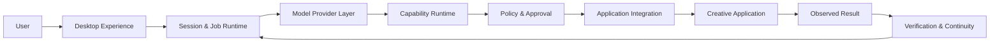

# Vincea

**Vincea is a local-first AI operator for professional creative software.**

It is designed to understand the working context inside creative applications, reason about a user's goal, and carry out multi-step work through application-aware integrations instead of treating the software as a generic chat destination.

> This repository is Vincea's public technical/developer surface. It is not a full source distribution of the product.

## What makes the problem different

Professional creative applications contain real project state: scenes, layers, timelines, selections, materials, cameras, documents, assets, and application-specific rules.

Vincea is built around four ideas:

- **Application-aware context** — the AI works with the state of the active creative workflow.
- **Capability-based actions** — application operations are exposed as bounded capabilities rather than arbitrary authority.
- **Policy and human approval** — higher-risk actions can require explicit user involvement.
- **Verification after action** — requested work and observed application state are treated as different things.

When a native application integration is not available for a particular task, Vincea can also use a screen-based interaction fallback. It additionally supports generative-asset workflows for producing media that can be brought back into a creative project.

## Public system view

This diagram is deliberately conceptual. Production implementation, distribution, activation, and private infrastructure are outside the scope of this repository.

## What the runtime is designed to do

A Vincea task may span multiple model/tool turns. The runtime is designed around long-running work rather than a single request/response:

- session-scoped work;
- background job execution;
- progress events;
- pause, resume, and cancellation;
- user-input and approval checkpoints;
- provider-independent model execution;
- application capabilities plus global workspace/vision/media capabilities;
- structured tool outcomes;
- post-action verification;
- context continuity across follow-up work.

Read [Runtime concepts](docs/runtime-concepts.md) and [Request lifecycle](docs/request-lifecycle.md).

## Application integrations

The private implementation contains integration work across 3D/DCC, design, video, CAD, game-engine, and texturing applications.

Examples include Blender, Maya, Houdini, Unreal Engine, 3ds Max, Cinema 4D, AutoCAD, Fusion 360, Photoshop, Illustrator, After Effects, Premiere Pro, DaVinci Resolve, SketchUp, and Substance applications.

Presence of integration work does **not** mean every application has the same maturity or feature depth. Public releases are reviewed independently.

See [Application landscape](docs/application-landscape.md).

## Generative assets

Vincea also includes a creative asset-generation layer for image, video, audio/music, voice, and 3D workflows. Generated assets are intended to become part of the same local creative workflow rather than a disconnected generation experience.

See [Generative asset workflows](docs/generative-assets.md).

## Technical documentation

### System model

- [Product overview](docs/product-overview.md)
- [Architecture overview](docs/architecture-overview.md)
- [Request lifecycle](docs/request-lifecycle.md)
- [Runtime concepts](docs/runtime-concepts.md)
- [Design principles](docs/design-principles.md)

### Capabilities, results, and safety

- [Capability design](docs/capability-design.md)
- [Action and result model](docs/action-result-model.md)
- [Tool safety model](docs/tool-safety-model.md)
- [Error model](docs/error-model.md)
- [Security model](docs/security-model.md)

### Context and providers

- [Sessions and memory](docs/sessions-and-memory.md)
- [Provider abstraction](docs/provider-abstraction.md)

### Integration engineering

- [Integration concepts](docs/integration-concepts.md)
- [Application landscape](docs/application-landscape.md)
- [Integration authoring guide](docs/integration-authoring-guide.md)
- [Testing strategy](docs/testing-strategy.md)
- [Compatibility philosophy](docs/compatibility-philosophy.md)

### Developer concepts

The SDK material is documentation-only. It does not publish Vincea's production implementation or wire formats.

- [SDK concept overview](docs/sdk/overview.md)
- [Adapter concepts](docs/sdk/adapter-concepts.md)
- [Tool contract concepts](docs/sdk/tool-contract-concepts.md)
- [Testing philosophy](docs/sdk/testing-philosophy.md)

### Release discipline

- [Security for integration authors](docs/security-for-integration-authors.md)
- [Provenance and licensing](docs/provenance-and-licensing.md)
- [Application integration release checklist](docs/addon-release-checklist.md)

## Public vs proprietary

This repository intentionally documents architecture responsibilities, design principles, integration guidance, and selected audited integrations.

Vincea uses proprietary runtime, distribution, activation, and production infrastructure that are outside the scope of this repository.

## Attribution

**Vincea**

Originally created and developed by **Michael Vo — Pelago**

https://github.com/Pelag-Michael
