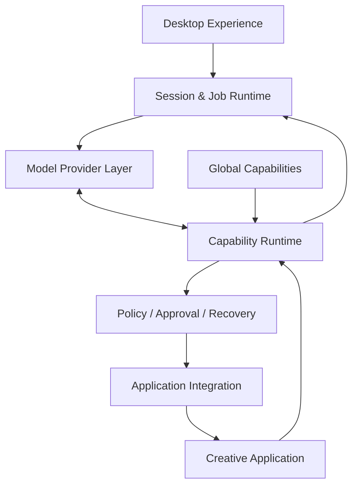

# Architecture overview

The public architecture can be understood as six responsibilities.

## Desktop experience

The user works through a desktop application that exposes chat, progress, application control, settings, and creative workflows.

## Session and job runtime

Work is associated with a session and executed as a job. Long-running work can emit progress, wait for user input, pause, resume, cancel, and finish with a structured result.

## Model provider layer

The runtime is provider-independent at the product level. Different model providers can participate behind a common execution model.

## Capability runtime

The model sees a tool surface composed from the active application's capabilities plus global capabilities such as workspace operations, knowledge, vision, media understanding, or asset generation.

## Policy, approval, and recovery

Model intent is not treated as execution authority. The runtime applies policy before actions and can involve the user when an operation carries higher risk or needs missing information.

## Application integration

Application-specific integration translates approved operations into the host application's own scripting, extension, or automation surface.

## Global capabilities

Some capabilities are not tied to a single creative application. Examples include workspace/file assistance, visual context, screen-based fallback interaction, knowledge, and generative assets.

The exact production implementation of these responsibilities is proprietary.
