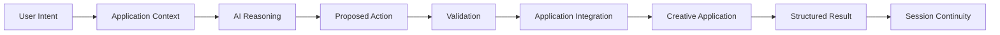

# Request lifecycle

This document describes the public conceptual lifecycle of a Vincea request.

## 1. User intent

The process starts with the user's request. The request may refer to current application state, prior interaction context, or a desired creative outcome.

## 2. Application context

Relevant application information is made available at a conceptual level so the model can reason about the actual working environment.

## 3. AI reasoning

The model interprets the request and decides whether the answer should be informational, operational, or a combination of both.

## 4. Proposed action

When application work is needed, the model proposes a supported action with parameters.

## 5. Validation

The requested action is checked against the capabilities intentionally exposed by the integration.

## 6. Application execution

The integration translates the validated request into an operation understood by the target application.

## 7. Structured result

The integration reports success, failure, warnings, and relevant output in a form that can support continued work.

## 8. Continuity

Useful results can inform the active session so follow-up instructions can remain context-aware.

This is a conceptual developer view, not a production state-machine specification.
