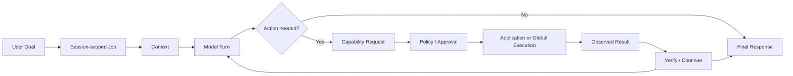

# Request lifecycle

A Vincea request is a loop, not just a single model call.

## 1. Accept the work

The request is associated with a session and becomes a runtime job.

The job carries enough non-secret identity to keep work tied to the intended session, application context, execution route, and selected model.

## 2. Compose context

The model receives the user request together with the relevant session, application, capability, and workflow context.

## 3. Model turn

The model can either answer directly or request one or more supported actions.

## 4. Policy and user involvement

Before an action reaches the target environment, the runtime evaluates whether it is allowed and whether the user must approve or clarify anything.

## 5. Execute

The chosen application integration or global capability performs the operation.

## 6. Observe the result

Execution returns an outcome that represents what actually happened, not merely what the model intended.

## 7. Verify and continue

For work that changes project state, the runtime can require follow-up inspection or verification before the task is treated as complete.

## 8. Finish

The final response summarizes the observed outcome and leaves the session ready for the next instruction.

During longer jobs, the user can receive progress information and may be able to pause, resume, cancel, approve, or provide requested input.
