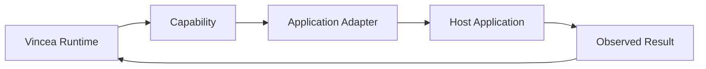

# Vincea Integration SDK — concept overview

This section documents a **developer concept**, not a published production SDK.

The goal is to describe what a stable public integration layer would need to express without copying Vincea's internal interfaces.

## Conceptual responsibilities

A developer-facing integration layer should make it possible to describe:

- target application identity;
- capabilities;
- action inputs;
- execution outcomes;
- compatibility information;
- lifecycle/health information.

## Conceptual flow

## Design goals

- application-specific behavior stays close to the application adapter;
- capabilities remain bounded;
- inputs are validated;
- results describe application reality;
- provider choice does not leak into the host adapter.

This repository intentionally does not publish executable SDK code or production protocol formats.
