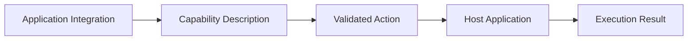

# Vincea Integration SDK — concept overview

The Vincea Integration SDK is described here as a **developer concept**, not as a published implementation.

Its purpose is to provide a consistent way to think about application integrations.

## Conceptual responsibilities

A developer-facing integration layer would help an application integration describe:

- application identity;
- available capabilities;
- action inputs;
- execution results;
- lifecycle state;
- compatibility metadata.

## What this repository provides

This repository provides documentation for these concepts so developers can understand the intended design philosophy.

It does **not** provide an executable SDK implementation or production interface definition.

## Conceptual flow

## Design goals

- application-specific behavior stays close to the application integration;
- capability boundaries remain explicit;
- validation happens before host execution;
- results remain understandable;
- integrations can be tested independently.
